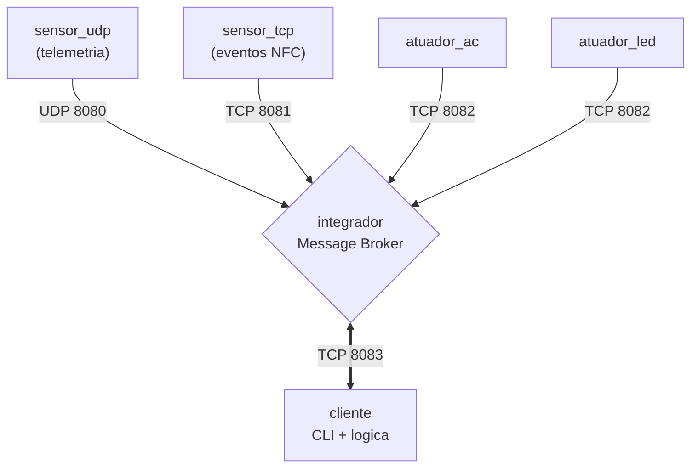

# PBL 1 - Redes: A Rota das Coisas

Projeto da disciplina de **Conectividade e Concorrencia** com arquitetura IoT distribuida baseada em **Message Broker**, usando **Go + UDP/TCP + Docker**.

> **Atualizacao da arquitetura:** a implementacao atual separa os atuadores em dois servicos independentes (`atuador_ac` e `atuador_led`), mantendo o Integrador como gateway cego e o Cliente como cerebro da logica de negocio.

## Topicos

- [Visao Geral](#visao-geral)
- [Arquitetura Atual](#arquitetura-atual)
- [Componentes do Sistema](#componentes-do-sistema)
- [Protocolo de Mensagens](#protocolo-de-mensagens)
- [Mapeamento de Portas](#mapeamento-de-portas)
- [Estrutura do Projeto](#estrutura-do-projeto)
- [Como Executar com Docker Compose](#como-executar-com-docker-compose)
- [Como Executar em Rede Distribuida](#como-executar-em-rede-distribuida)
- [Interface do Cliente (CLI)](#interface-do-cliente-cli)
- [Comandos Docker Uteis](#comandos-docker-uteis)
- [Fluxo de Desenvolvimento](#fluxo-de-desenvolvimento)

---

## Visao Geral

A solucao separa infraestrutura e regra de negocio:

- **Sensores (`sensor_udp`, `sensor_tcp`)**: publicam dados para o Integrador.
- **Integrador (`integrador`)**: roteia mensagens entre sensores, clientes e atuadores.
- **Atuador de Ar (`atuador_ac`)**: recebe comandos de climatizacao (`LIGAR`, `DESLIGAR`, `SET_TEMP`).
- **Atuador de Lampada (`atuador_led`)**: recebe comandos de iluminacao (`LIGAR`, `DESLIGAR`).
- **Cliente (`cliente`)**: mantem estado por sala, aplica histerese termica e oferece menu manual.

---

## Arquitetura Atual



O Integrador apenas encaminha mensagens. Toda regra de automacao fica no Cliente.

---

## Componentes do Sistema

1. **`sensor_udp`**
- Envia leituras continuamente em UDP.
- Formato enviado: `TIPO|SALA|VALOR` (ex.: `T|SALA_1|25.50`).

2. **`sensor_tcp`**
- Envia eventos via conexao TCP persistente.
- Formato enviado: `NFC|CATRACA_ENTRADA|USER_4091`.

3. **`integrador`**
- Mantem lista de atuadores registrados por chave (`AC_SALA_1`, `LED_SALA_1`, etc.).
- Prefixa dados de sensores para os clientes:
    - `TLM|...` para telemetria
    - `EVT|...` para eventos
- Roteia comandos vindos do cliente no formato `ID_ATUADOR|COMANDO`.

4. **`atuador_ac`**
- Registra-se como `REG|AC|<SALA>`.
- Responde com `ACK|AC|<SALA>|<STATUS>`.

5. **`atuador_led`**
- Registra-se como `REG|LED|<SALA>`.
- Responde com `ACK|LED|<SALA>|<STATUS>`.

6. **`cliente`**
- Gerencia dinamicamente um mapa de salas.
- Controle manual de ar e lampada.
- Controle automatico com histerese (`alvo +/- 1.0`) para o ar-condicionado.

---

## Protocolo de Mensagens

Mensagens relevantes na implementacao atual:

- **Sensor UDP -> Integrador**: `T|SALA_1|25.50`
- **Integrador -> Cliente (telemetria)**: `TLM|T|SALA_1|25.50`
- **Sensor TCP -> Integrador**: `NFC|CATRACA_ENTRADA|USER_4091`
- **Integrador -> Cliente (evento)**: `EVT|NFC|CATRACA_ENTRADA|USER_4091`
- **Atuador -> Integrador (registro)**: `REG|AC|SALA_1` ou `REG|LED|SALA_1`
- **Cliente -> Integrador (comando)**: `AC_SALA_1|LIGAR`, `LED_SALA_1|DESLIGAR`, `AC_SALA_1|SET_TEMP 22.5`
- **Atuador -> Integrador -> Cliente (ack)**: `ACK|AC|SALA_1|LIGADO`, `ACK|LED|SALA_1|DESLIGADO`

---

## Mapeamento de Portas

| Protocolo | Porta | Uso |
| --- | --- | --- |
| UDP | `8080` | Entrada de sensores UDP |
| TCP | `8081` | Entrada de sensores TCP |
| TCP | `8082` | Registro e controle de atuadores |
| TCP | `8083` | Conexao de clientes/painel |

---

## Estrutura do Projeto

```text
.
├── docker-compose.yml
├── README.md
├── integrador/
│   ├── Dockerfile
│   ├── go.mod
│   └── main.go
├── cliente/
│   ├── Dockerfile
│   ├── go.mod
│   └── main.go
├── sensor_udp/
│   ├── Dockerfile
│   ├── go.mod
│   └── main.go
├── sensor_tcp/
│   ├── Dockerfile
│   ├── go.mod
│   └── main.go
├── atuador_ac/
│   ├── Dockerfile
│   ├── go.mod
│   └── main.go
└── atuador_led/
        ├── Dockerfile
        ├── go.mod
        └── main.go
```

---

## Como Executar com Docker Compose

```bash
git clone https://github.com/cleidson21/PBL_1_Redes-A_Rota_das_Coisas.git
cd PBL_1_Redes-A_Rota_das_Coisas

# sobe todo o ecossistema
docker compose up -d --build
```

Abrir interface do cliente:

```bash
docker attach cliente_dashboard
```

Sair sem derrubar o container: `Ctrl+P` e depois `Ctrl+Q`.

Logs uteis:

```bash
docker logs -f integrador_gateway
docker logs -f sensor_temp_sala1
docker logs -f sensor_nfc_entrada
docker logs -f atuador_ar_sala1
docker logs -f atuador_lampada_sala1
```

---

## Como Executar em Rede Distribuida

Exemplo em 3 maquinas:

- **PC 1 (Gateway)**: Integrador
- **PC 2 (Borda)**: Sensores e atuadores
- **PC 3 (Operacao)**: Cliente

1. **PC 1 - Integrador**

```bash
docker run -d --name integrador_pbl \
    -p 8080:8080/udp -p 8081:8081/tcp -p 8082:8082/tcp -p 8083:8083/tcp \
    cleidsonramos/integrador:v1
```

2. **PC 2 - Dispositivos**

```bash
# Sensor UDP
docker run -d --name sensor_udp_pbl \
    -e SERVER_ADDR="<IP_GATEWAY>:8080" \
    -e SENSOR_ID="SALA_1" \
    -e SENSOR_TIPO="T" \
    cleidsonramos/sensor_udp:v1

# Sensor TCP
docker run -d --name sensor_tcp_pbl \
    -e SERVER_ADDR="<IP_GATEWAY>:8081" \
    -e SENSOR_ID="CATRACA_ENTRADA" \
    -e SENSOR_TIPO="NFC" \
    cleidsonramos/sensor_tcp:v1

# Atuador AC
docker run -d --name atuador_ac_pbl \
    -e INTEGRADOR_ADDR="<IP_GATEWAY>:8082" \
    -e ATUADOR_ID="SALA_1" \
    -e ATUADOR_TIPO="AC" \
    cleidsonramos/atuador_ac:v1

# Atuador LED
docker run -d --name atuador_led_pbl \
    -e INTEGRADOR_ADDR="<IP_GATEWAY>:8082" \
    -e ATUADOR_ID="SALA_1" \
    -e ATUADOR_TIPO="LED" \
    cleidsonramos/atuador_led:v1
```

3. **PC 3 - Cliente**

```bash
docker run -it --name cliente_pbl \
    -e INTEGRADOR_ADDR="<IP_GATEWAY>:8083" \
    cleidsonramos/cliente:v1
```

---

## Interface do Cliente (CLI)

```text
===================================
PAINEL MULTI-SALA IoT
===================================
[1] Ver Status de Todas as Salas
[2] Ligar/Desligar Ar (Manual)
[3] Ligar/Desligar Modo Automatico
[4] Definir Nova Temperatura Alvo
[5] Ligar/Desligar Lampada (Manual)
[0] Sair
===================================
```

Detalhes importantes:

- Comando manual de ar desativa o modo automatico da sala.
- Ajuste de alvo envia `SET_TEMP` para o atuador AC e atualiza o estado local.
- Novas salas sao criadas automaticamente quando chegam dados com novo `ID`.

---

## Comandos Docker Uteis

```bash
# listar containers
docker ps

# parar e remover stack local
docker compose down

# reconstruir apenas um servico
docker compose up -d --build cliente

# limpeza geral
docker stop $(docker ps -aq) 2>/dev/null; docker system prune -a --volumes -f
```

---

## Fluxo de Desenvolvimento

Rebuild de imagens por servico:

```bash
docker build -t cleidsonramos/integrador:v2 ./integrador
docker build -t cleidsonramos/cliente:v2 ./cliente
docker build -t cleidsonramos/sensor_udp:v2 ./sensor_udp
docker build -t cleidsonramos/sensor_tcp:v2 ./sensor_tcp
docker build -t cleidsonramos/atuador_ac:v2 ./atuador_ac
docker build -t cleidsonramos/atuador_led:v2 ./atuador_led
```

Publicacao (opcional):

```bash
docker push cleidsonramos/integrador:v2
docker push cleidsonramos/cliente:v2
docker push cleidsonramos/sensor_udp:v2
docker push cleidsonramos/sensor_tcp:v2
docker push cleidsonramos/atuador_ac:v2
docker push cleidsonramos/atuador_led:v2
```