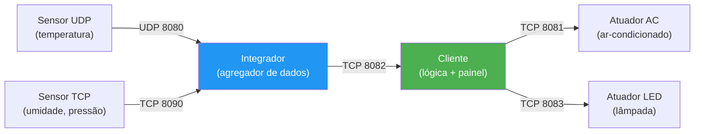

# PBL 1 - Redes: A Rota das Coisas

Projeto da disciplina de **Conectividade e Concorrência** com arquitetura IoT distribuída usando **Go + UDP/TCP + Docker**.

> **Nova arquitetura descentralizada**: Cliente centraliza lógica de controle. Suporta múltiplos sensores (UDP/TCP), múltiplos atuadores (polimórficos: AC, lâmpada, etc.) e integrador como simples agregador de dados.

## Tópicos

- [Visão Geral](#visão-geral)
- [Arquitetura Distribuída](#arquitetura-distribuída)
- [Componentes do Sistema](#componentes-do-sistema)
- [Serviços e Portas](#serviços-e-portas)
- [Estrutura do Projeto](#estrutura-do-projeto)
- [Como Executar](#como-executar)
- [Cenário 1: Ambiente Local com Docker Compose](#cenário-1-ambiente-local-com-docker-compose)
- [Cenário 2: Rede Real com 3 Máquinas](#cenário-2-rede-real-com-3-máquinas)
- [Lógica de Controle (Cliente)](#lógica-de-controle-cliente)
- [Tipos de Atuadores](#tipos-de-atuadores)
- [Fluxo de Dados](#fluxo-de-dados)
- [Validação e Logs](#validação-e-logs)
- [Comandos de Manutenção Docker](#comandos-de-manutenção-docker)
- [Fluxo de Desenvolvimento](#fluxo-de-desenvolvimento)

---

## Visão Geral

A nova arquitetura **descentraliza a inteligência** do integrador para o cliente:

- **Sensores** (UDP/TCP): coletam telemetria e enviam para o integrador.
- **Integrador**: agregador passivo de dados, recebe múltiplos sensores e fornece dados ao cliente.
- **Cliente** (**inteligência do sistema**): processa múltiplos sensores, aplica regras AUTO/MANUAL complexas e comanda múltiplos atuadores polimórficos.
- **Atuadores**: executam comandos específicos (ar-condicionado, lâmpada, ventilador, etc.).

---

## Arquitetura Distribuída



---

## Componentes do Sistema

### Sensores

- **sensor_udp**: envia telemetria (ex: temperatura) via UDP ao integrador. Executa continuamente a cada 2-5s.
- **sensor_tcp**: envia telemetria (ex: umidade, pressão) via TCP ao integrador. Conexão persistente ou reconexão automática.

### Integrador

Agregador passivo de dados:
- Recebe mensagens de múltiplos sensores (UDP porta 8080, TCP porta 8090).
- Armazena último valor recebido de cada sensor.
- Fornece dados ao cliente sob demanda via TCP porta 8082.
- Não contém lógica de negócio.

### Cliente (Painel + Lógica Centralizada)

**Centraliza toda a inteligência do sistema**:
- Conecta ao integrador para ler valores dos sensores.
- Conecta a múltiplos atuadores simultaneamente (suporta 2+ atuadores).
- Gerencia modo **AUTO** (termostato, hidrostato, etc.) e **MANUAL** (controle direto).
- Arbitra regras de negócio complexas baseadas em valores dos sensores (ex: IF temp > 25 E humidade > 60% THEN liga AC).
- Oferece interface interativa para operador.
- Histórico em memória de eventos e estados.

### Atuadores (Polimórficos)

Cada atuador é uma instância independente com tipo específico:

- **Ar-condicionado (AC)** porta 8081: estados (LIGADO, DESLIGADO), temperatura-alvo, velocidade do ventilador.
- **Lâmpada (LED)** porta 8083: estados (LIGADO, DESLIGADO), intensidade (0-100%).
- **Extensível**: novo atuador = novo container + nova porta + registro no cliente.

---

## Serviços e Portas

| Serviço | Protocolo | Porta | Origem → Destino | Função |
|---|---|---:|---|---|
| `sensor_udp` | UDP | `8080/udp` | Sensor UDP → Integrador | Telemetria (temperatura) |
| `sensor_tcp` | TCP | `8090/tcp` | Sensor TCP → Integrador | Telemetria (umidade, pressão) |
| `integrador` | TCP | `8082/tcp` | Cliente → Integrador | Cliente consulta sensores |
| `atuador_ac` | TCP | `8081/tcp` | Cliente → Atuador AC | Comandos ar-condicionado |
| `atuador_led` | TCP | `8083/tcp` | Cliente → Atuador LED | Comandos lâmpada |

---

## Estrutura do Projeto

```text
.
├── docker-compose.yml
├── README.md
├── sensor_udp/
│   ├── Dockerfile
│   └── main.go
├── sensor_tcp/
│   ├── Dockerfile
│   └── main.go
├── integrador/
│   ├── Dockerfile
│   └── main.go
├── atuador_ac/
│   ├── Dockerfile
│   └── main.go
├── atuador_led/
│   ├── Dockerfile
│   └── main.go
└── cliente/
    ├── Dockerfile
    └── main.go
```

---

## Como Executar

### Opção 1: Ambiente Local com Docker Compose

Use `docker-compose.yml` para subir todos os serviços localmente (ideal para testes rápidos).

### Opção 2: Rede Real com 3 Máquinas

Distribua serviços em 3 máquinas físicas/VMs (cenário de validação real).

---

## Cenário 1: Ambiente Local com Docker Compose

### 1) Clonar repositório

```bash
git clone https://github.com/cleidson21/PBL_1_Redes-A_Rota_das_Coisas.git
cd PBL_1_Redes-A_Rota_das_Coisas
```

### 2) Subir todos os containers

```bash
docker compose up -d --build
```

### 3) Ver logs em tempo real

Terminal 1 (Integrador):
```bash
docker logs -f integrador_pbl
```

Terminal 2 (Sensores):
```bash
docker logs -f sensor_udp_pbl
docker logs -f sensor_tcp_pbl
```

Terminal 3 (Atuadores):
```bash
docker logs -f atuador_ac_pbl
docker logs -f atuador_led_pbl
```

### 4) Abrir painel cliente (interativo)

```bash
docker attach cliente_pbl
```

Sair **sem derrubar** o container: `Ctrl+P` + `Ctrl+Q`.

### 5) Encerrar ambiente

```bash
docker compose down
```

---

## Cenário 2: Rede Real com 3 Máquinas

Distribuição recomendada:

- **PC1**: `sensor_udp`, `sensor_tcp`, `atuador_ac`, `atuador_led` (IoT Edge)
- **PC2**: `integrador` (Data Broker)
- **PC3**: `cliente` (Painel + Lógica Central)

### Ordem Obrigatória de Inicialização

1. Descobrir e anotar IPs de `PC1` e `PC2`.
2. Subir **Integrador** no `PC2` (servidor de dados).
3. Subir **Sensores** no `PC1`.
4. Subir **Atuadores** no `PC1`.
5. Subir **Cliente** no `PC3` (último, pois depende de tudo).

### 1) Descobrir IPs (Linux)

Em cada máquina:
```bash
hostname -I
```

Anote:
- `<IP_PC1>` = IP de PC1 (sensores/atuadores)
- `<IP_PC2>` = IP de PC2 (integrador)

### 2) PC2 - Subir Integrador (primeiro)

```bash
docker run -d --name integrador_pbl \
  -p 8080:8080/udp \
  -p 8090:8090/tcp \
  -p 8082:8082/tcp \
  cleidsonramos/integrador:v4
```

Verificar logs:
```bash
docker logs integrador_pbl
```

Firewall (opcional, se habilitado):
```bash
sudo ufw allow 8080/udp
sudo ufw allow 8090/tcp
sudo ufw allow 8082/tcp
```

### 3) PC1 - Subir Sensores (segundo)

**Sensor UDP (temperatura):**
```bash
docker run -d --name sensor_udp_pbl \
  -e SERVER_ADDR="<IP_PC2>:8080" \
  cleidsonramos/sensor_udp:v4
```

**Sensor TCP (umidade):**
```bash
docker run -d --name sensor_tcp_pbl \
  -e SERVER_ADDR="<IP_PC2>:8090" \
  cleidsonramos/sensor_tcp:v4
```

Verificar logs:
```bash
docker logs -f sensor_udp_pbl
docker logs -f sensor_tcp_pbl
```

### 4) PC1 - Subir Atuadores (terceiro)

**Atuador AC:**
```bash
docker run -d --name atuador_ac_pbl \
  -p 8081:8081/tcp \
  cleidsonramos/atuador_ac:v1
```

**Atuador LED:**
```bash
docker run -d --name atuador_led_pbl \
  -p 8083:8083/tcp \
  cleidsonramos/atuador_led:v1
```

Firewall (opcional):
```bash
sudo ufw allow 8081/tcp
sudo ufw allow 8083/tcp
```

Verificar logs:
```bash
docker logs -f atuador_ac_pbl
docker logs -f atuador_led_pbl
```

### 5) PC3 - Subir Cliente (quarto e último)

```bash
docker run -it --name cliente_pbl \
  -e INTEGRADOR_ADDR="<IP_PC2>:8082" \
  -e ATUADOR_AC_ADDR="<IP_PC1>:8081" \
  -e ATUADOR_LED_ADDR="<IP_PC1>:8083" \
  cleidsonramos/cliente:v4
```

Cliente abrirá painel interativo. Aguarde ~2s para conexões estabilizarem.

---

## Lógica de Controle (Cliente)

O **cliente** contém toda a inteligência do sistema. Executa continuamente:

### 1) Leitura de Sensores (a cada 2s)

```
┌─────────────────────────────────────┐
│ Cliente consulta Integrador         │
│  GET /sensors                       │
│  → Temperatura (sensor_udp)         │
│  → Umidade (sensor_tcp)             │
└─────────────────────────────────────┘
     ↓
┌─────────────────────────────────────┐
│ Armazena no histórico em memória    │
│ (últimos 100 eventos)               │
└─────────────────────────────────────┘
```

### 2) Modo Automático (Termostato Inteligente)

Regra de negócio exemplo:

```
IF temperatura > alvo_ac (ex: 25°C):
  → LIGAR AC
  → DESLIGAR LED
ELSE IF temperatura < alvo_ac - histerese (ex: 22°C):
  → DESLIGAR AC

IF umidade > 70%:
  → Aumentar velocidade AC ventilador
```

Cliente executa essa lógica **no seu próprio processo**, sem depender do integrador.

### 3) Modo Manual

Operador comanda diretamente via painel:
- Ignora modo automático temporariamente.
- Envia comando ao atuador específico.
- Registra em log.

### 4) Envio de Comandos

Cliente conecta aos atuadores via TCP:

```
Cliente → Atuador AC (8081):
  "AC:LIGAR:0"

Cliente → Atuador LED (8083):
  "LED:SET_INTENSIDADE:75"
```

Formato: `<TIPO>:<COMANDO>:<VALOR>`

---

## Tipos de Atuadores

### Ar-Condicionado (AC) — Porta 8081

Estado simulado:
- Temperatura interna (20-30°C)
- Velocidade ventilador (1-5)
- Consumo energia (quando ligado)

Comandos suportados:
- `AC:LIGAR:0` → liga compressor
- `AC:DESLIGAR:0` → desliga compressor
- `AC:SET_TEMP:22` → alvo de 22°C
- `AC:SET_VELOCIDADE:3` → velocidade ventilador (1-5)

Resposta:
```
{
  "tipo": "AC",
  "estado": "LIGADO",
  "temp_interna": 23.5,
  "temp_alvo": 22,
  "velocidade": 3,
  "consumo_watts": 750
}
```

### Lâmpada (LED) — Porta 8083

Estado simulado:
- Intensidade luminosa (0-100%)
- Temperatura cor (3000-6500K)
- Consumo energia (quando ligada)

Comandos suportados:
- `LED:LIGAR:0` → liga lâmpada (100% intensidade)
- `LED:DESLIGAR:0` → desliga lâmpada
- `LED:SET_INTENSIDADE:50` → intensidade 0-100%
- `LED:SET_COR:3000` → temperatura cor em Kelvin

Resposta:
```
{
  "tipo": "LED",
  "estado": "LIGADO",
  "intensidade": 50,
  "cor_kelvin": 4000,
  "consumo_watts": 15
}
```

### Extensível para Novos Atuadores

Para adicionar novo atuador (ex: ventilador):
1. Criar pasta `atuador_ventilador/` com `Dockerfile` + `main.go`.
2. Registrar porta no `docker-compose.yml` (ex: `8084`).
3. Adicionar variável de ambiente no cliente: `ATUADOR_VENTILADOR_ADDR`.
4. Implementar lógica de comando no cliente em `main.go`.

---

## Fluxo de Dados

```
┌──────────────────┐
│  Sensor UDP      │ Envia temperatura a cada 3s
└────────┬─────────┘
         │ UDP 8080
         ▼
    ┌─────────────────────────────────┐
    │   Integrador                    │
    │   (Agregador Passivo)           │
    │                                 │
    │   Sensor_UDP: 24.5°C            │
    │   Sensor_TCP: 65% umidade       │
    └────────┬──────────────────────────┘
             │ TCP 8082
             │ (Cliente puxa dados a cada 2s)
             ▼
    ┌─────────────────────────────────┐
    │   Cliente                       │
    │   (Lógica + Painel)             │
    │                                 │
    │   Processa:                     │
    │   - Modo AUTO/MANUAL            │
    │   - Regras de negócio           │
    │   - Histórico de eventos        │
    └────┬───────────────────────┬────┘
         │                       │
      TCP 8081               TCP 8083
         │                       │
         ▼                       ▼
    ┌─────────────┐         ┌─────────────┐
    │  AC         │         │   LED       │
    │  LIGADO     │         │  75% INT    │
    │  22°C       │         │  4000K      │
    └─────────────┘         └─────────────┘
```

---

## Interface do Painel (Cliente)

Exemplo de interação:

```
╔════════════════════════════════════════╗
║   Sistema IoT - A Rota das Coisas      ║
║   Versão 4.0 - Cliente com Lógica      ║
╚════════════════════════════════════════╝

[1] STATUS
[2] AUTO (ativar termostato)
[3] MANUAL (controle direto)
[4] AC - LIGAR
[5] AC - DESLIGAR
[6] AC - SET_ALVO <valor>
[7] LED - LIGAR
[8] LED - DESLIGAR
[9] LED - SET_INTENSIDADE <0-100>
[10] HISTÓRICO
[0] Sair

Entrada: 1
├─ Temperatura (UDP): 23.5°C
├─ Umidade (TCP): 65%
├─ AC: DESLIGADO (alvo: 22°C, velocidade: 0)
├─ LED: LIGADO (intensidade: 75%, cor: 4000K)
└─ Modo: AUTO

Entrada: 6
Digite valor alvo para AC: 20
[INFO] Alvo AC alterado para 20°C
[INFO] AC será ligado quando temp > 20°C
```

---

## Validação e Logs

### PC2 - Integrador

```bash
docker logs -f integrador_pbl
```

Esperado:
```
[INFO] Integrador iniciando...
[INFO] Listening UDP 8080 (sensor_udp)
[INFO] Listening TCP 8090 (sensor_tcp)
[INFO] Listening TCP 8082 (cliente queries)
[RECV] sensor_udp: 23.5
[RECV] sensor_tcp: 65
[QUERY] cliente solicitou dados
```

### PC1 - Sensores

```bash
docker logs -f sensor_udp_pbl
docker logs -f sensor_tcp_pbl
```

Esperado:
```
[INFO] Conectando a <IP_PC2>:8080 (UDP)
[SEND] Temperatura: 23.5°C
[SEND] Temperatura: 23.7°C
...
```

### PC1 - Atuadores

```bash
docker logs -f atuador_ac_pbl
docker logs -f atuador_led_pbl
```

Esperado:
```
[INFO] Atuador AC escutando 8081
[CMD_RECV] AC:LIGAR:0
[STATUS] AC: DESLIGADO → LIGADO (temp_interna: 20.0°C)
[CMD_RECV] AC:SET_VELOCIDADE:3
[STATUS] Velocidade ventilador: 3
```

### PC3 - Cliente

```bash
docker logs -f cliente_pbl
# ou
docker attach cliente_pbl
```

Esperado:
```
[INFO] Cliente iniciando...
[CONN] Conectado ao integrador <IP_PC2>:8082
[CONN] Conectado ao AC <IP_PC1>:8081
[CONN] Conectado ao LED <IP_PC1>:8083
[SENSOR_READ] Temp: 23.5°C, Umidade: 65%
[MODE] Automático ativado
[AUTO_RULE] Temp (23.5) < Alvo (22)? Não → DESLIGAR AC
[PAINEL] Aguardando entrada do operador...
```

---

## Comandos de Manutenção Docker

```bash
# Listar containers ativos
docker ps

# Listar todos (inclusive parados)
docker ps -a

# Ver logs completos
docker logs <nome>

# Ver logs em tempo real
docker logs -f <nome>

# Parar container sem remover
docker stop <nome>

# Iniciar container parado
docker start <nome>

# Reiniciar container
docker restart <nome>

# Remover container
docker rm -f <nome>

# Limpar volumes não usados
docker volume prune
```

Nomes dos containers:
- `integrador_pbl`
- `sensor_udp_pbl`
- `sensor_tcp_pbl`
- `atuador_ac_pbl`
- `atuador_led_pbl`
- `cliente_pbl`

---

## Fluxo de Desenvolvimento

Após modificações no código:

### Build e Push das imagens

```bash
# Sensores
docker build -t cleidsonramos/sensor_udp:v4 ./sensor_udp
docker push cleidsonramos/sensor_udp:v4

docker build -t cleidsonramos/sensor_tcp:v4 ./sensor_tcp
docker push cleidsonramos/sensor_tcp:v4

# Integrador
docker build -t cleidsonramos/integrador:v4 ./integrador
docker push cleidsonramos/integrador:v4

# Atuadores
docker build -t cleidsonramos/atuador_ac:v1 ./atuador_ac
docker push cleidsonramos/atuador_ac:v1

docker build -t cleidsonramos/atuador_led:v1 ./atuador_led
docker push cleidsonramos/atuador_led:v1

# Cliente (com lógica centralizada)
docker build -t cleidsonramos/cliente:v4 ./cliente
docker push cleidsonramos/cliente:v4
```

### Commit no repositório

```bash
git add .
git commit -m "feat: nova arquitetura com lógica centralizada no cliente e atuadores polimórficos"
git push
```

---

## Notas de Design

- **Lógica centralizada no cliente**: facilita manutenção, testes e adição de novas regras.
- **Integrador desacoplado**: simples agregador, escalável, sem dependência de lógica complexa.
- **Atuadores polimórficos**: novo tipo = novo container + porta + registro no cliente.
- **Protocolo simples**: `TIPO:COMANDO:VALOR` facilita debug e testes manuais com `nc` ou `telnet`.
- **Telemetria contínua**: sensores não bloqueiam, integrador não espera cliente, cliente processa assincronamente.
- **Histórico em memória**: cliente mantém últimos 100 eventos para análise pós-operação.
- **Firewall amigável**: portas bem definidas, fácil de documentar e restringir em produção.

---

## Troubleshooting

| Problema | Causa | Solução |
|---|---|---|
| Cliente não conecta ao integrador | IP incorreto em `INTEGRADOR_ADDR` | Verificar `hostname -I` em PC2 |
| Sensores não enviam dados | Integrador offline | Verificar `docker logs integrador_pbl` |
| Atuador não responde | Cliente IP/porta errada | Verificar variáveis `ATUADOR_*_ADDR` |
| "Connection refused" na rede | Firewall bloqueando | `sudo ufw allow <porta>` |
| Container sai sem erro | Crash silencioso | `docker logs <nome>` para stderr |