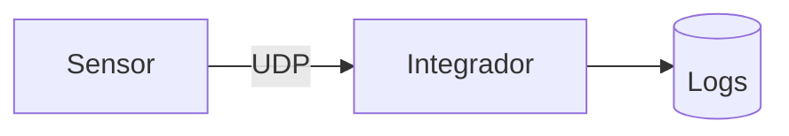
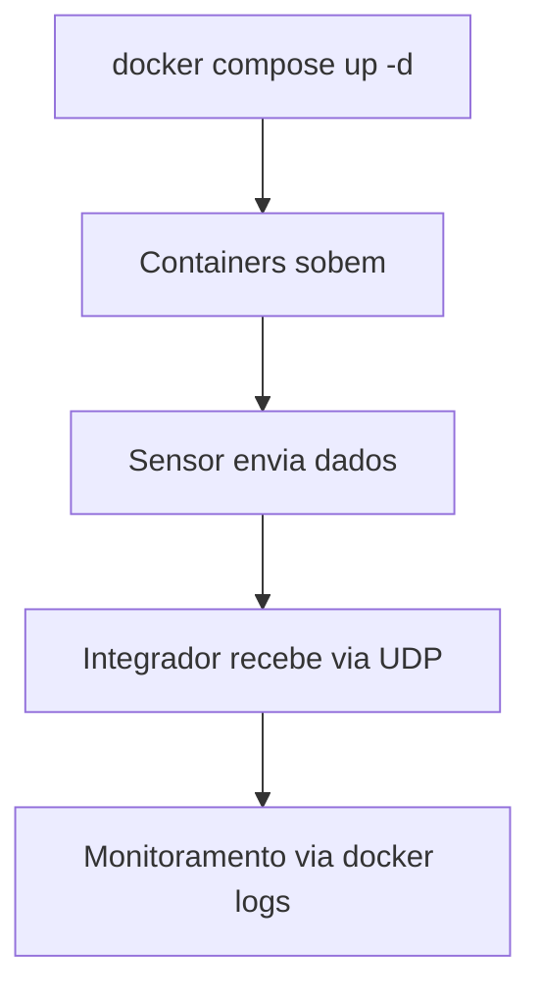

# PBL 1 - Redes: A Rota das Coisas

Projeto da disciplina de **Conectividade e Concorrencia** para reduzir alto acoplamento em sistemas IoT.
O sistema usa **Go + UDP + Docker** para simular a comunicacao entre sensores e um integrador central.

## Topicos

- [Visao Geral](#visao-geral)
- [Arquitetura](#arquitetura)
- [Estrutura do Projeto](#estrutura-do-projeto)
- [Como Executar](#como-executar)
- [Cenario 1: Teste Local com Docker Compose](#cenario-1-teste-local-com-docker-compose)
- [Cenario 2: Rede Real com Duas Maquinas](#cenario-2-rede-real-com-duas-maquinas)
- [Comandos de Manutencao Docker](#comandos-de-manutencao-docker)
- [Fluxo de Desenvolvimento](#fluxo-de-desenvolvimento)

## Visao Geral

Este repositorio contem componentes IoT separados em servicos:

- `sensor`: gera e envia dados via UDP
- `integrador`: recebe os dados e centraliza o processamento
- `cliente` e `atuador`: modulos de apoio para evolucao do ecossistema

## Arquitetura



### Fluxo de execucao (local)



## Estrutura do Projeto

```text
.
├── docker-compose.yml
├── README.md
├── atuador/
├── cliente/
├── integrador/
│   ├── Dockerfile
│   └── main.go
└── sensor/
    ├── Dockerfile
    └── main.go
```

## Como Executar

Voce pode testar de duas formas:

1. **Cenario local** com `docker compose` na mesma maquina.
2. **Cenario em rede real** com integrador e sensor em maquinas diferentes.

## Cenario 1: Teste Local com Docker Compose

Ideal para desenvolvimento rapido na mesma maquina.

### 1) Clonar o repositorio

```bash
git clone https://github.com/cleidson21/PBL_1_Redes-A_Rota_das_Coisas.git
cd PBL_1_Redes-A_Rota_das_Coisas
```

### 2) Subir os containers

```bash
docker compose up -d
```

### 3) Acompanhar logs

```bash
docker logs -f integrador_pbl
docker logs -f sensor_pbl
```

### 4) Parar e remover ambiente

```bash
docker compose down
```

## Cenario 2: Rede Real com Duas Maquinas

Simula um ambiente real em rede (laboratorio, LAN ou Wi-Fi).

### PC 1: Integrador

1. Inicie o integrador expondo a porta UDP `8080`:

```bash
docker run -d --name integrador_pbl -p 8080:8080/udp cleidsonramos/integrador:v2
```

2. Descubra o IP da maquina:

```bash
# Linux
hostname -I

# Windows (PowerShell ou CMD)
ipconfig
```

3. (Opcional, recomendado) Libere firewall:

```bash
sudo ufw allow 8080/udp
```

### PC 2: Sensor

Inicie o sensor apontando para o IP do integrador:

```bash
docker run -d --name sensor_pbl -e SERVER_ADDR="<IP_DO_INTEGRADOR>:8080" cleidsonramos/sensor:v2
```

Exemplo:

```bash
docker run -d --name sensor_pbl -e SERVER_ADDR="172.16.201.2:8080" cleidsonramos/sensor:v2
```

### Verificando recebimento no integrador

No PC 1:

```bash
docker logs -f integrador_pbl
```

## Comandos de Manutencao Docker

Substitua `<nome>` por `integrador_pbl` ou `sensor_pbl`.

```bash
# Containers em execucao
docker ps

# Parar container (sem remover)
docker stop <nome>

# Iniciar container parado
docker start <nome>

# Reiniciar container
docker restart <nome>

# Remover container
docker rm -f <nome>
```

## Fluxo de Desenvolvimento

Sempre que alterar codigo Go (`main.go`) ou configuracoes:

### 1) Build e push das imagens (Docker Hub)

Atualize a versao da tag, por exemplo `v2 -> v3`.

```bash
# Sensor
docker build -t cleidsonramos/sensor:v3 ./sensor
docker push cleidsonramos/sensor:v3

# Integrador
docker build -t cleidsonramos/integrador:v3 ./integrador
docker push cleidsonramos/integrador:v3
```

### 2) Commit e push no GitHub

```bash
git add .
git commit -m "feat: atualiza logica do sensor e documentacao"
git push
```
