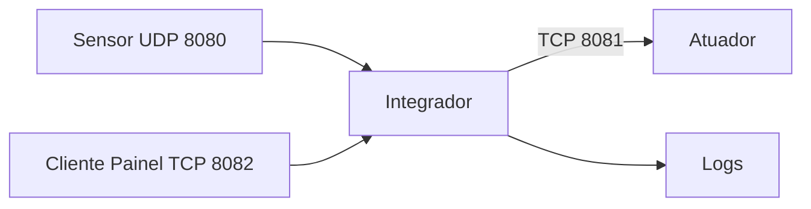
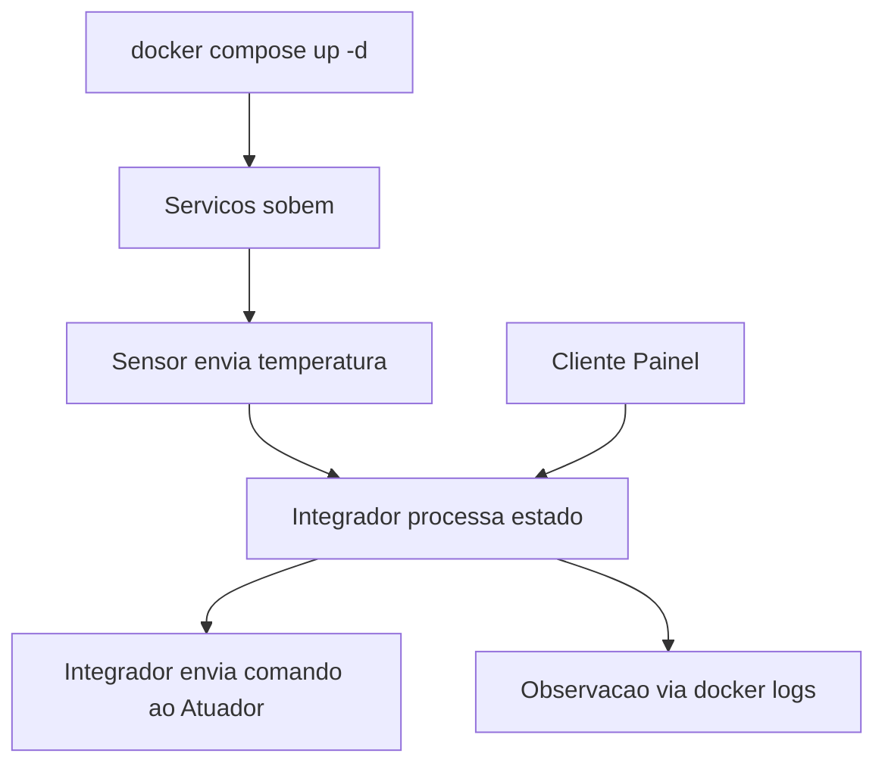

# PBL 1 - Redes: A Rota das Coisas

Projeto da disciplina de **Conectividade e Concorrencia** com foco em desacoplamento de um ecossistema IoT.
O sistema atual usa **Go + UDP/TCP + Docker** e agora inclui controle automatico/manual do ar-condicionado via painel.

## Topicos

- [Visao Geral](#visao-geral)
- [Arquitetura Atual](#arquitetura-atual)
- [Servicos e Portas](#servicos-e-portas)
- [Estrutura do Projeto](#estrutura-do-projeto)
- [Como Executar](#como-executar)
- [Cenario 1: Ambiente Local com Docker Compose](#cenario-1-ambiente-local-com-docker-compose)
- [Cenario 2: Rede Real com Tres Maquinas](#cenario-2-rede-real-com-tres-maquinas)
- [Comandos do Painel (Cliente)](#comandos-do-painel-cliente)
- [Comandos de Manutencao Docker](#comandos-de-manutencao-docker)
- [Fluxo de Desenvolvimento](#fluxo-de-desenvolvimento)

## Visao Geral

O repositorio esta dividido em 4 componentes principais:

- `sensor`: gera telemetria de temperatura e envia via UDP.
- `integrador`: recebe telemetria, aplica regras de controle e orquestra o sistema.
- `atuador`: recebe comandos TCP (`LIGAR`, `DESLIGAR`, `SET_TEMP`) e simula o ar-condicionado.
- `cliente` (painel): interface em terminal para monitoramento e comandos manuais/automaticos.

## Arquitetura Atual



### Fluxo local (docker compose)



## Servicos e Portas

| Servico | Protocolo | Porta | Funcao |
|---|---|---:|---|
| `sensor` | UDP (saida) | `8080` (destino no integrador) | Envio continuo de telemetria |
| `integrador` | UDP (entrada) | `8080/udp` | Receber temperatura do sensor |
| `integrador` | TCP (entrada) | `8082/tcp` | Receber comandos do painel/cliente |
| `atuador` | TCP (entrada) | `8081/tcp` | Executar comandos de refrigeracao |
| `cliente` | TCP (saida) | `8082` (destino no integrador) | Painel interativo de controle |

## Estrutura do Projeto

```text
.
├── docker-compose.yml
├── README.md
├── atuador/
│   ├── Dockerfile
│   └── main.go
├── cliente/
│   ├── Dockerfile
│   └── main.go
├── integrador/
│   ├── Dockerfile
│   └── main.go
└── sensor/
        ├── Dockerfile
        └── main.go
```

## Como Executar

Voce pode validar o projeto de duas formas:

1. `docker compose` (todos os servicos na mesma maquina).
2. Rede real com maquinas separadas (sensor+atuador em um host, integrador em outro e cliente em outro).

## Cenario 1: Ambiente Local com Docker Compose

### 1) Clonar o repositorio

```bash
git clone https://github.com/cleidson21/PBL_1_Redes-A_Rota_das_Coisas.git
cd PBL_1_Redes-A_Rota_das_Coisas
```

### 2) Subir os containers

```bash
docker compose up -d --build
```

### 3) Acompanhar logs principais

```bash
docker logs -f integrador_pbl
docker logs -f sensor_pbl
docker logs -f atuador_pbl
```

### 4) Abrir o painel (cliente)

Como o `cliente` e interativo, use `attach` para operar o menu:

```bash
docker attach cliente_pbl
```

Para sair do `attach` sem derrubar o container, use `Ctrl+P` seguido de `Ctrl+Q`.

### 5) Parar e remover ambiente

```bash
docker compose down
```

## Cenario 2: Rede Real com Tres Maquinas

Simula laboratorio/LAN/Wi-Fi com servicos distribuidos em 3 hosts.

### Ordem de prioridade (recomendado)

1. Descobrir e anotar os IPs necessarios (`PC 1` e `PC 2`).
2. Subir o `integrador` no `PC 2`.
3. Subir o `atuador` no `PC 1`.
4. Subir o `sensor` no `PC 1`.
5. Subir o painel `cliente` no `PC 3`.

### 1) Descobrir IPs antes de subir os containers

No `PC 1` (Sensor + Atuador), anote o IP como `<IP_DO_PC1>`:

```bash
# Linux
hostname -I

# Windows (PowerShell/CMD)
ipconfig
```

No `PC 2` (Integrador), anote o IP como `<IP_DO_PC2>`:

```bash
# Linux
hostname -I

# Windows (PowerShell/CMD)
ipconfig
```

### PC 1: Sensor + Atuador

1. Inicie o atuador (TCP `8081`):

```bash
docker run -d --name atuador_pbl -p 8081:8081/tcp cleidsonramos/atuador:v1
```

2. Inicie o sensor apontando para o integrador (PC 2):

```bash
docker run -d --name sensor_pbl \
    -e SERVER_ADDR="IP_DO_PC2:8080" \
    cleidsonramos/sensor:v3
```

### PC 2: Integrador

1. Inicie o integrador (UDP `8080` + TCP `8082`) apontando para o atuador no PC 1:

```bash
docker run -d --name integrador_pbl \
    -p 8080:8080/udp \
    -p 8082:8082/tcp \
    -e ATUADOR_ADDR="IP_DO_PC1:8081" \
    cleidsonramos/integrador:v3
```

2. (Opcional, recomendado) Libere firewall no PC 2:

```bash
sudo ufw allow 8080/udp
sudo ufw allow 8082/tcp
```

3. (Opcional, recomendado) Libere firewall no PC 1:

```bash
sudo ufw allow 8081/tcp
```

### PC 3: Painel (Cliente)

1. Inicie o cliente/painel apontando para o integrador (PC 2):

```bash
docker run -it --name cliente_pbl \
    -e INTEGRADOR_ADDR="IP_DO_PC2:8082" \
    cleidsonramos/cliente:v1
```

### Verificacao

No PC 1:

```bash
docker logs -f sensor_pbl
docker logs -f atuador_pbl
```

No PC 2:

```bash
docker logs -f integrador_pbl
```

## Comandos do Painel (Cliente)

Menu disponivel no `cliente`:

- `[1]` `STATUS`: mostra temperatura atual, estado do ar, modo e alvo.
- `[2]` `AUTO`: ativa controle automatico no integrador.
- `[3]` `MANUAL`: ativa modo manual.
- `[4]` `LIGAR`: liga ar-condicionado manualmente.
- `[5]` `DESLIGAR`: desliga ar-condicionado manualmente.
- `[6]` `SET_ALVO <valor>`: define nova temperatura alvo e reativa modo automatico.
- `[0]` sair do painel.

## Comandos de Manutencao Docker

```bash
# Containers em execucao
docker ps

# Parar container (sem remover)
docker stop <nome>

# Iniciar container parado
docker start <nome>

# Reiniciar container
docker restart <nome>

# Remover container
docker rm -f <nome>
```

Exemplos de `<nome>`: `sensor_pbl`, `integrador_pbl`, `atuador_pbl`, `cliente_pbl`.

## Fluxo de Desenvolvimento

Sempre que alterar codigo Go (`main.go`) ou Dockerfiles:

### 1) Build e push das imagens (Docker Hub)

Atualize as tags de versao (`v1`, `v2`, `v3`...).

```bash
# Sensor
docker build -t cleidsonramos/sensor:v3 ./sensor
docker push cleidsonramos/sensor:v3

# Integrador
docker build -t cleidsonramos/integrador:v3 ./integrador
docker push cleidsonramos/integrador:v3

# Atuador
docker build -t cleidsonramos/atuador:v1 ./atuador
docker push cleidsonramos/atuador:v1

# Cliente (Painel)
docker build -t cleidsonramos/cliente:v1 ./cliente
docker push cleidsonramos/cliente:v1
```

### 2) Commit e push no GitHub

```bash
git add .
git commit -m "docs: atualiza arquitetura com atuador, cliente e painel"
git push
```
