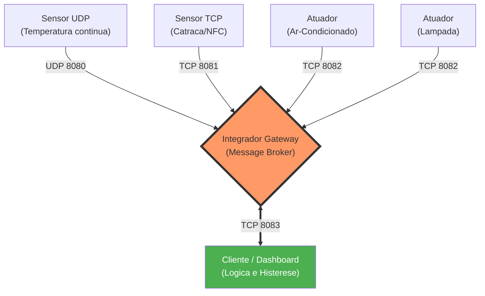

# PBL 1 - Redes: A Rota das Coisas

Projeto da disciplina de **Conectividade e Concorrencia** com arquitetura IoT distribuida baseada no padrao de **Message Broker** usando **Go + UDP/TCP + Docker**.

> **Arquitetura descentralizada:** o Integrador atua como um roteador de mensagens (Gateway/Broker) totalmente cego e escalavel. A logica de negocio (cerebro) foi movida para o Cliente. O sistema suporta a adicao dinamica de multiplos Sensores (UDP/TCP) e multiplos Atuadores polimorficos usando a mesma base de codigo.

## Topicos

- [Visao Geral](#visao-geral)
- [Arquitetura do Message Broker](#arquitetura-do-message-broker)
- [Componentes do Sistema](#componentes-do-sistema)
- [Mapeamento de Portas](#mapeamento-de-portas)
- [Estrutura do Projeto](#estrutura-do-projeto)
- [Como Executar (Local com Docker Compose)](#como-executar-local-com-docker-compose)
- [Como Executar (Rede Distribuida)](#como-executar-rede-distribuida)
- [A Interface do Cliente (Cerebro)](#a-interface-do-cliente-cerebro)
- [Comandos de Manutencao Docker](#comandos-de-manutencao-docker)
- [Fluxo de Desenvolvimento](#fluxo-de-desenvolvimento)

---

## Visao Geral

A arquitetura resolve o problema do "Ponto Unico de Falha" e o acoplamento, separando infraestrutura de rede da regra de negocio:

- **Sensores (UDP/TCP):** coletam dados de forma ativa (streaming continuo) ou reativa (eventos) e injetam na rede.
- **Integrador (Broker):** agregador passivo e roteador de rede. Nao contem estado de negocio. Apenas recebe de uma porta e repassa para a porta correta.
- **Atuadores (Polimorficos):** clientes TCP que se conectam ao Integrador e aguardam ordens (`LIGAR`, `DESLIGAR`, `SET_TEMP`). Avisam o sucesso da operacao via respostas `ACK`.
- **Cliente (Cerebro + CLI):** processa leituras de todos os sensores simultaneamente. Executa histerese termica (modo automatico) e roteia comandos manuais.

---

## Arquitetura do Message Broker



**Grande sacada (inversao de controle):** as setas dos Atuadores apontam para o Integrador. Os Atuadores sao clientes TCP que "discam" para o servidor central, contornando bloqueios comuns de firewall em redes IoT.

---

## Componentes do Sistema

1. **Sensores**
     - `sensor_udp`: envia telemetria (ex.: temperatura) em loop infinito sem confirmacao de entrega. Leve e rapido.
     - `sensor_tcp`: simula eventos garantidos (ex.: passagem de cracha NFC em catraca) usando conexao TCP persistente.
2. **Atuador (Polimorfico)**
     - Existe apenas um codigo-fonte de atuador.
     - O comportamento (Ar-Condicionado ou Lampada) e injetado via variavel de ambiente `ATUADOR_TIPO`.
     - Ao conectar, envia uma mensagem de registro ao Integrador.
3. **Integrador (Roteador)**
     - Mantem "listas telefonicas" (maps em Go com protecao `sync.Mutex`) das conexoes ativas.
     - Tudo que entra nas portas de sensores (`8080` e `8081`) sofre broadcast para os clientes (`8083`).
     - Tudo que entra da porta de cliente (`8083`) e processado para encontrar o tunel de rede correto e ser roteado pontualmente ao atuador (`8082`).
4. **Cliente (Cerebro)**
     - Executa duas trilhas em paralelo (goroutines):
     - Ouvinte oculto: cataloga dados vindos do Integrador, atualiza mapa de salas e roda a logica automatica.
     - Interface CLI: exibe menu interativo para intervencao manual.

---

## Mapeamento de Portas

O Integrador e o unico servico que expoe portas. Todos os outros sao clientes que "discam" para ele.

| Protocolo | Porta exposta | Funcao no Integrador |
| --- | --- | --- |
| UDP | `8080` | Ouve sensores de temperatura continuos |
| TCP | `8081` | Ouve sensores de eventos (NFC/catracas) |
| TCP | `8082` | Ouve atuadores e repassa comandos para eles |
| TCP | `8083` | Ouve clientes (paineis) e repassa os dados da rede |

---

## Estrutura do Projeto

```text
.
├── docker-compose.yml
├── README.md
├── sensor_udp/     (Telemetria em massa via UDP)
│   ├── Dockerfile
│   └── main.go
├── sensor_tcp/     (Eventos criticos via TCP)
│   ├── Dockerfile
│   └── main.go
├── atuador/        (Codigo polimorfico TCP)
│   ├── Dockerfile
│   └── main.go
├── cliente/        (Logica de negocio e CLI)
│   ├── Dockerfile
│   └── main.go
└── integrador/     (Message Broker multi-thread)
        ├── Dockerfile
        └── main.go
```

---

## Como Executar (Local com Docker Compose)

Esta e a forma mais facil de validar o ecossistema rodando.

1. **Clonar e subir**

```bash
git clone https://github.com/cleidson21/PBL_1_Redes-A_Rota_das_Coisas.git
cd PBL_1_Redes-A_Rota_das_Coisas

# Compila as imagens e sobe toda a rede
docker compose up -d --build
```

2. **Acessar o painel interativo (Cliente)**

Como o cliente precisa de entrada de teclado, use:

```bash
docker attach cliente_dashboard
```

Para sair da tela do cliente sem matar o programa, pressione `Ctrl+P` e depois `Ctrl+Q`.

3. **Monitorar logs (opcional)**

```bash
docker logs -f integrador_gateway
docker logs -f sensor_temp_sala1
docker logs -f atuador_ar_sala1
```

---

## Como Executar (Rede Distribuida)

Para um cenario realista, distribuindo a carga em 3 computadores.

Identifique os IPs:

- **PC 1 (Gateway):** anote o IP (`IP_GATEWAY`).
- **PC 2 (Borda):** rodara sensores e atuadores.
- **PC 3 (Usuario):** rodara o painel do cliente.

1. **No PC 1 (Gateway Central)**

Suba o Integrador expondo todas as portas necessarias:

```bash
docker run -d --name integrador_pbl \
    -p 8080:8080/udp -p 8081:8081/tcp -p 8082:8082/tcp -p 8083:8083/tcp \
    cleidsonramos/integrador:v1
```

2. **No PC 2 (Dispositivos de Borda)**

Suba os dispositivos apontando as variaveis de ambiente para o PC 1:

```bash
# Sensor de temperatura
docker run -d --name sensor_udp_pbl \
    -e SERVER_ADDR="<IP_GATEWAY>:8080" \
    cleidsonramos/sensor_udp:v1

# Atuador do ar-condicionado
docker run -d --name atuador_ac_pbl \
    -e INTEGRADOR_ADDR="<IP_GATEWAY>:8082" \
    -e ATUADOR_TIPO="AR_CONDICIONADO" \
    cleidsonramos/atuador:v1
```

3. **No PC 3 (Operador)**

Rode o painel de forma interativa apontando para o PC 1:

```bash
docker run -it --name cliente_pbl \
    -e INTEGRADOR_ADDR="<IP_GATEWAY>:8083" \
    cleidsonramos/cliente:v1
```

---

## A Interface do Cliente (Cerebro)

O menu interativo prove as seguintes opcoes (geridas dinamicamente via map):

```text
===================================
PAINEL MULTI-SALA IoT
===================================
[1] Ver Status de Todas as Salas
[2] Ligar/Desligar Ar (Manual)
[3] Ligar/Desligar Modo Automatico
[4] Definir Nova Temperatura Alvo
[5] Ligar/Desligar Lampada (Manual)
[0] Sair
===================================
```

**Auto-descobrimento:** se um sensor da `SALA_2` for ligado na rede, a opcao `[1]` detecta automaticamente sua existencia e passa a aplicar histerese termica para essa nova sala sem necessidade de recompilacao.

---

## Comandos de Manutencao Docker

```bash
# Ver servicos em execucao
docker ps

# Desligar a rede inteira local
docker compose down

# Apagar imagens orfas e liberar espaco em disco
docker system prune -a
```

---

## Fluxo de Desenvolvimento

Caso voce modifique o codigo fonte em Go, gere o build das novas imagens substituindo `v1` por versoes subsequentes:

```bash
# Exemplo: recompilar o atuador e publicar no Docker Hub
docker build -t cleidsonramos/atuador:v2 ./atuador
docker push cleidsonramos/atuador:v2
```